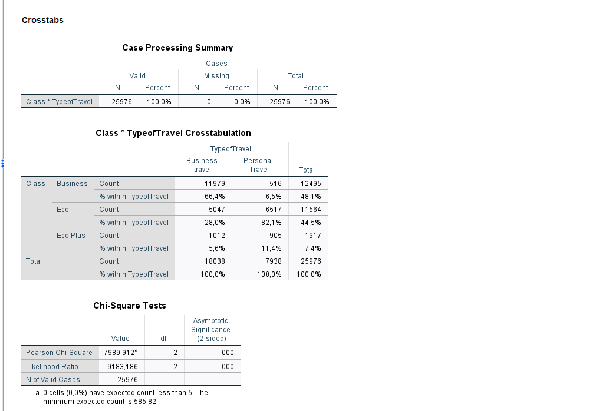
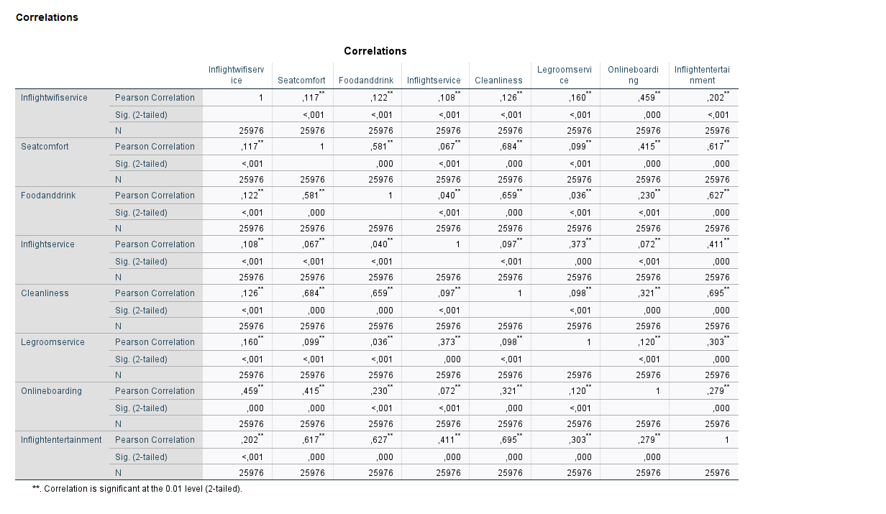
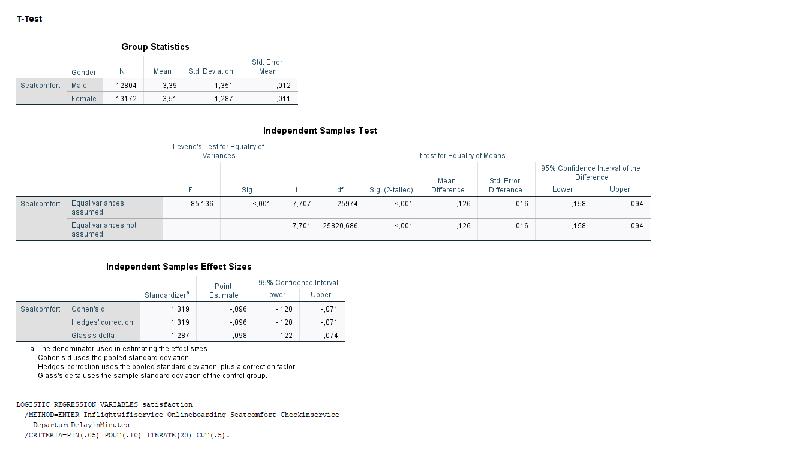
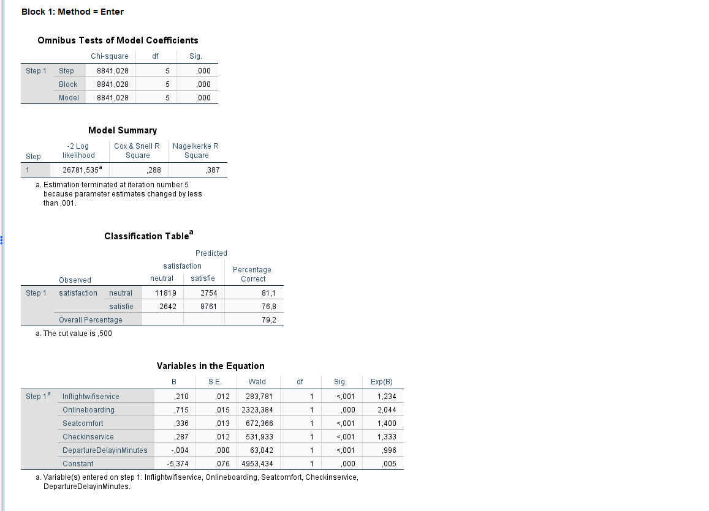

# Airline Passenger Satisfaction Analysis (IBM SPSS)

## 📌 Project Overview
This project presents a statistical analysis of airline passenger satisfaction data using **IBM SPSS Statistics**. The objective is to identify key factors influencing customer satisfaction and determine if travel purpose significantly relates to chosen travel classes.

## 📊 Dataset Information
* **Source:** Kaggle Airline Passenger Satisfaction Dataset
* **Sample Size:** 25,976 respondents
* **Key Variables:** 
  * **Demographic / Flight Details:** `Gender`, `Customer Type`, `Age`, `Type of Travel`, `Class`
  * **Satisfaction Ratings (Likert scale 1–5):** `Inflight wifi service`, `Seat comfort`, `Food and drink`, `Inflight entertainment`, `Cleanliness`, etc.
  * **Target Variable:** `Satisfaction` (Satisfied vs. Neutral/Dissatisfied)

---

## 🔬 Key Statistical Analyses & Findings

### 1. Travel Class vs. Purpose of Travel (Chi-Square Test of Independence)

#### **Research Question & Hypotheses**
* **Objective:** Determine whether a passenger's purpose of travel (`TypeofTravel`: Business vs. Personal) is statistically independent of their chosen travel class (`Class`: Business, Eco, Eco Plus).
* **Null Hypothesis ($H_0$):** Purpose of travel and travel class are independent (no association exists).
* **Alternative Hypothesis ($H_1$):** Purpose of travel and travel class are significantly associated.

#### **Crosstabulation Data Breakdown**
Based on the sample of $N = 25,976$ respondents, the cross-tabulation revealed distinct patterns:
* **Business Travelers ($N = 18,038$):** Overwhelmingly prefer Business Class, representing the majority of higher-tier cabin bookings.
* **Personal Travelers ($N = 7,938$):** Predominantly travel in Eco Class, with very low representation in Business Class.
* **Eco Plus:** Serves a minor segment for both group profiles ($5.6\%$ of business travelers vs. $11.4\%$ of personal travelers).

#### **Chi-Square Test Results**
A Pearson's Chi-Square Test of Independence was executed in IBM SPSS:
* **Test Statistic ($\chi^2$):** $7989.912$
* **Degrees of Freedom ($df$):** $2$
* **Asymptotic Significance ($p$-value):** $< 0.001$ (reported as `.000` in SPSS)
* **Sample Size ($N$):** $25,976$
* **Assumption Check:** $0$ cells ($0.0\%$) have expected count less than $5$. Minimum expected count is $585.82$ (Assumption fully met).



#### **Statistical Interpretation & Business Conclusion**
Since the $p$-value is far below the standard threshold of $\alpha = 0.05$, we **reject the null hypothesis ($H_0$)**. 
* **Conclusion:** There is an extremely strong, statistically significant association between travel purpose and selected cabin class ($\chi^2(2, N = 25976) = 7989.91, p < 0.001$).
* **Practical Insight:** Flight purpose is a primary segmenting driver for cabin demand. Business travelers prioritize comfort/space offered in Business Class, while personal travel is highly price-sensitive, leaning heavily toward Economy options.

---

### 2. Pearson Correlation Analysis (In-Flight Experience Factors)

A Bivariate Pearson Correlation analysis was conducted across 8 in-flight service parameters ($N = 25,976$). All reported correlations are statistically significant at $p < 0.001$.



#### **Key Analytical Takeaways:**
1. **The "Cabin Environment" Cluster ($r > 0.60$):**
   * Strongest positive correlations exist between `Cleanliness` and `Inflight entertainment` ($r = 0.695$), `Seat comfort` ($r = 0.684$), and `Food and drink` ($r = 0.659$).
   * *Business Insight:* Passenger perception of physical hygiene strongly cross-contaminates their ratings of soft amenities (food, entertainment, seat feel).
2. **The "Digital Passenger" Association ($r = 0.459$):**
   * Moderate positive correlation between `Inflight wifi service` and `Ease of Online boarding`.
   * *Business Insight:* Tech-oriented passengers who utilize digital boarding options place a higher value on onboard connectivity.
3. **Orthogonal Features ($r < 0.10$):**
   * Functional attributes like `Leg room service` and `Food and drink` ($r = 0.036$) operate independently in passenger evaluation.

---

### 3. Gender Differences in Seat Comfort (Independent Samples T-Test)

An Independent Samples T-Test was conducted to compare seat comfort ratings (`Seatcomfort`) between male ($N = 12,804$) and female ($N = 13,172$) passengers.



#### **Statistical Findings:**
* **Levene's Test for Equality of Variances:** $F = 85.14, p < 0.001$ (Equal variances not assumed).
* **Test Result:** Female passengers rated seat comfort statistically significantly higher ($M = 3.51, SD = 1.287$) than male passengers ($M = 3.39, SD = 1.351$), $t(25820.69) = -7.701, p < 0.001, \text{Mean Diff} = -0.126$.
* **Effect Size Analysis:** Cohen's $d = -0.096$ ($95\% \text{ CI } [-0.120, -0.071]$).

#### **Business Takeaway:**
Although the difference is statistically significant due to the large sample size ($N = 25,976$), the effect size is trivial ($d < 0.10$). Gender is **not** a practical driver for seat comfort design or marketing segmentation.

---

### 4. Passenger Satisfaction Prediction (Binary Logistic Regression)

A Binary Logistic Regression was performed to predict passenger satisfaction (`Satisfaction`: Neutral/Dissatisfied = 0, Satisfied = 1) using 5 core service metrics as predictors ($N = 25,976$).



#### **Model Performance & Goodness of Fit:**
* **Omnibus Test:** $\chi^2(5) = 8841.03, p < 0.001$ (Model is statistically significant).
* **Nagelkerke $R^2$:** $0.387$ (Model explains $38.7\%$ of the variance in customer satisfaction).
* **Classification Accuracy:** **$79.2\%$** overall correct classification rate ($81.1\%$ for neutral/dissatisfied, $76.8\%$ for satisfied).

#### **Predictor Impact Analysis — Odds Ratios $\text{Exp}(B)$:**
All included variables are statistically significant predictors ($p < 0.001$):
1. **`Onlineboarding` ($\text{Exp}(B) = 2.044$):** The strongest positive predictor. For every 1-unit increase in online boarding rating, the odds of a passenger being satisfied increase by **$104.4\%$** ($\text{OR} = 2.04$).
2. **`Seatcomfort` ($\text{Exp}(B) = 1.400$):** Increases odds of satisfaction by **$40.0\%$** per unit.
3. **`Checkinservice` ($\text{Exp}(B) = 1.333$):** Increases odds of satisfaction by **$33.3\%$** per unit.
4. **`Inflightwifiservice` ($\text{Exp}(B) = 1.234$):** Increases odds of satisfaction by **$23.4\%$** per unit.
5. **`DepartureDelayinMinutes` ($\text{Exp}(B) = 0.996$):** Each minute of departure delay decreases the odds of satisfaction by **$0.4\%$**.

#### **Business Conclusion:**
Streamlining digital processes (online boarding) and enhancing ergonomic comfort yield the highest ROI for improving passenger satisfaction metrics.

---

## 🛠️ Tools Used
* **IBM SPSS Statistics:** Data cleaning, Crosstabulations, Chi-Square Testing, Pearson Correlation, Independent T-Test, Binary Logistic Regression.
* **Markdown:** Documentation & LaTeX math typesetting.

## 📂 Repository Structure

```text
├── data/
│   ├── test.csv
│   └── airline_satisfaction.sav
├── outputs/
│   ├── Analysis_Output.spv
│   ├── chi_square_table.png
│   ├── correlation_matrix.png
│   ├── t_test_table.png
│   └── logistic_regression_table.png
└── README.md
